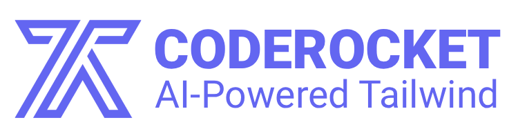

<p align="center">
  
</p>

<p align="center">
  Open source AI website and component builder with a self-hosted default setup.
</p>

<p align="center">
  <a href="https://github.com/elreco/coderocket/actions/workflows/ci.yml"></a>
  <a href="https://github.com/elreco/coderocket/blob/main/LICENSE"></a>
  <a href="https://github.com/elreco/coderocket/discussions"></a>
  <a href="https://www.coderocket.app/open-source"></a>
  <a href="https://nextjs.org/"></a>
  <a href="https://supabase.com/"></a>
</p>

# CodeRocket

CodeRocket is an AI website and component builder that can run as:

- a self-hosted open source app,
- a local development stack with the integrated `builder`,
- or the managed CodeRocket cloud at [coderocket.app](https://www.coderocket.app).

This repository is now structured so the default path is self-hosting first. Cloud-only integrations such as Stripe billing, Vercel domain management, and Vercel Blob storage are optional adapters, not hard requirements.

## Community

- Website: [coderocket.app](https://www.coderocket.app)
- Open source overview: [coderocket.app/open-source](https://www.coderocket.app/open-source)
- Documentation: [docs.coderocket.app](https://docs.coderocket.app)
- Issues: [github.com/elreco/coderocket/issues](https://github.com/elreco/coderocket/issues)
- Discussions: [github.com/elreco/coderocket/discussions](https://github.com/elreco/coderocket/discussions)
- Contributing guide: [CONTRIBUTING.md](./CONTRIBUTING.md)
- Security policy: [SECURITY.md](./SECURITY.md)

## What is in the repo

- `app/`: the Next.js application.
- `builder/`: the build service used to compile and store user apps.
- `docs/`: Mintlify documentation.
- `supabase/`: local Supabase config, migrations, and database notes.

## Why self-host CodeRocket

- Keep the full app and builder in one repository.
- Run locally without Stripe, Vercel Domains, or Vercel Blob.
- Swap optional cloud adapters back in only when you need them.
- Use the hosted [coderocket.app](https://www.coderocket.app) experience as an upsell path if you want a managed version too.

## Self-hosting modes

- Local minimal:
  Run Next.js + the integrated builder with filesystem storage and no Stripe/Vercel dependencies.
- Self-host with wildcard domains:
  Use your own root domain for deployed apps, previews, and webcontainers.
- Managed cloud:
  Keep CodeRocket branding and optionally point upsell links back to [coderocket.app](https://www.coderocket.app).

## Quick start

### 1. Install dependencies

```bash
npm install
npm --prefix builder install
```

Optional docs:

```bash
npm --prefix docs install
```

### 2. Create your environment files

```bash
cp .env.example .env.local
cp builder/.env.example builder/.env
```

Use `.env.local` for your machine-specific app secrets. The builder-specific file is only there for people who want to run `builder/` independently.
If you already have a local `.env`, prefer consolidating into `.env.local` to avoid confusion.

### 3. Start Supabase locally

```bash
npx supabase start
npx supabase db reset
npm run generate-types
```

Important:
`supabase/current_state.sql` is reference material only. See [supabase/README.md](./supabase/README.md) for the baseline/export workflow.

### 4. Run the stack

App + builder:

```bash
npm run dev:all
```

App only:

```bash
npm run dev
```

Builder only:

```bash
npm run builder:dev
```

Docs only:

```bash
npm run docs:dev
```

The default app URL is `http://localhost:4002`.

If you want the builder to run fully independently from the app, you can still use `builder/.env`, but the default developer path is now the monorepo with `.env.local` at the root.

## Environment model

The repo now uses a normalized configuration contract.

### Core URLs

- `NEXT_PUBLIC_APP_URL`: canonical URL of this instance.
- `NEXT_PUBLIC_CLOUD_URL`: optional upsell target for the hosted CodeRocket cloud.
- `NEXT_PUBLIC_DOCS_URL`: docs base URL.

### Deployment domains

- `NEXT_PUBLIC_DEPLOYMENT_ROOT_DOMAIN`: wildcard root for deployed apps.
- `NEXT_PUBLIC_PREVIEW_ROOT_DOMAIN`: wildcard root for previews.
- `NEXT_PUBLIC_WEBCONTAINER_ROOT_DOMAIN`: wildcard root for live webcontainer previews.

Local development also supports a path fallback under `/webcontainer/<prefix>` so wildcard DNS is not required.

### Builder

- `BUILDER_API_URL`
- `NEXT_PUBLIC_BUILDER_API_URL`
- `BUILDER_HOST`
- `BUILDER_PORT`
- `BUILDER_AUTH_TOKEN`
- `BUILDER_STORAGE_DRIVER=fs|vercel-blob`
- `BUILDER_STORAGE_FS_ROOT`
- `BUILDER_TEMP_DIR`

### Billing

- `BILLING_PROVIDER=none|stripe`
- `NEXT_PUBLIC_BILLING_PROVIDER=none|stripe`

When billing is `none`, deploy/custom-domain flows stay available locally and Stripe routes are disabled.

### Domain provider

- `DOMAIN_PROVIDER=none|vercel`
- `NEXT_PUBLIC_DOMAIN_PROVIDER=none|vercel`

When the provider is `none`, DNS ownership verification still works, but HTTPS and routing are expected to be handled by your hosting platform or reverse proxy.

## Local deployment behavior

The builder now supports two storage modes:

- `fs`: default for local and self-hosted installs.
- `vercel-blob`: optional cloud adapter.

For local installs, builds are stored under `.coderocket/builds` by default and served back through the Next.js app.

When exposing the builder on a public network, set `BUILDER_AUTH_TOKEN` on both the app and the builder so build and scraping endpoints are not anonymous.

## Database bootstrap

The current Supabase history was not maintained exclusively through CLI migrations during development. Because of that:

- keep treating `supabase/current_state.sql` as informational only,
- use `supabase/migrations/20260501000000_baseline_from_authoritative_schema.sql` as the active baseline candidate,
- keep `supabase/baseline.schema.sql` as the authoritative schema snapshot,
- and verify a real local `supabase db reset` once Docker is available before treating the baseline as fully validated.

The old migration chain is archived under `supabase/migrations-legacy/`. Going forward, the intended model is one verified baseline migration plus new forward migrations.

Details and commands live in [supabase/README.md](./supabase/README.md).

## Open source checklist

- rotate every secret that has ever lived in a tracked `.env`,
- rewrite Git history before making the repository public if tracked `.env` files ever existed,
- do not publish production data dumps,
- keep custom billing/domain adapters optional,
- set `BUILDER_AUTH_TOKEN` before exposing the builder publicly,
- run `npm run type-check`,
- run `node --check builder/server.js`,
- verify a local build/deploy flow before releasing.

If you are opening the repo publicly for the first time, do the secret rotation and history rewrite before flipping visibility.

## Scripts

- `npm run dev`
- `npm run builder:dev`
- `npm run builder:start`
- `npm run dev:all`
- `npm run dev:all:docs`
- `npm run docs:dev`
- `npm run docs:build`
- `npm run type-check`
- `npm run generate-types`

## Cloud upsell

Self-hosted instances can keep their own domain and branding, while links such as documentation or hosted upgrade flows can still point to [coderocket.app](https://www.coderocket.app) via `NEXT_PUBLIC_CLOUD_URL`.
