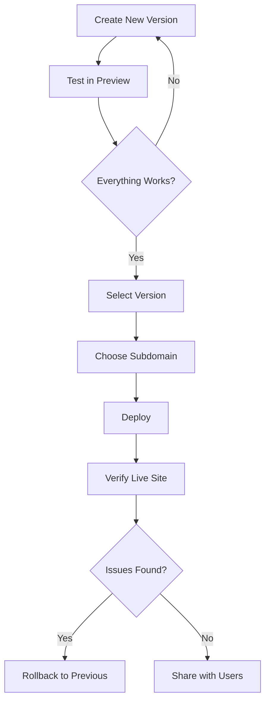

## Planning Your Deployment

### Choose Meaningful Subdomains

Your subdomain is your application's identity. Make it count:

<CardGroup cols={2}>
  <Card title="Good Subdomains" icon="check">
    - `portfolio-2024`
    - `my-store`
    - `blog-demo`
    - `project-tracker`
  </Card>
  <Card title="Avoid" icon="x">
    - `test123`
    - `app`
    - `asdf`
    - `project1`
  </Card>
</CardGroup>

<Tip>
  Think long-term. You'll share this URL with others, so choose something professional and memorable.
</Tip>

### Version Selection Strategy

**Deploy the latest version when:**
- You've thoroughly tested all changes
- All features work as expected
- No known critical bugs exist

**Deploy a previous version when:**
- The latest version has issues
- You want to showcase a specific feature set
- Rolling back from a problematic update

<Info>
  Always test in preview mode before deploying a new version to production.
</Info>

## Pre-Deployment Checklist

Before clicking deploy, verify:

<Steps>
  <Step title="Test in Preview">
    - Open the preview of your selected version
    - Test all interactive features
    - Check responsiveness on different screen sizes
    - Verify integrations work correctly
  </Step>

  <Step title="Verify Integrations">
    - Ensure required integrations are enabled
    - Test database connections
    - Confirm API endpoints respond
    - Check authentication flows (if applicable)
  </Step>

  <Step title="Review Content">
    - Check for placeholder text or images
    - Verify all links work
    - Ensure no development/debugging code remains
    - Confirm proper error handling
  </Step>

  <Step title="Check Subdomain">
    - Subdomain is available
    - Follows naming conventions
    - Easy to remember and share
    - Represents your project well
  </Step>
</Steps>

## Deployment Workflow

### Recommended Process

Follow this workflow for smooth deployments:



### Iterative Improvement

Use deployments to gather feedback:

1. **Deploy v1** - Basic functionality
2. **Collect Feedback** - From users or stakeholders
3. **Create v2** - With improvements
4. **Test Thoroughly** - Ensure v2 works perfectly
5. **Update Deployment** - Switch to v2
6. **Repeat** - Continue improving

## Managing Multiple Projects

### Subdomain Naming Convention

If you have multiple projects, use a consistent naming scheme:

```text
[category]-[project-name]
```

**Examples:**
- `portfolio-personal`
- `portfolio-client`
- `demo-ecommerce`
- `demo-blog`
- `client-dashboard`
- `client-website`

This makes it easy to remember and organize your deployments.

### Priority System

Not all projects need deployment. Prioritize:

<AccordionGroup>
  <Accordion title="High Priority - Deploy Immediately">
    - Client presentations
    - Portfolio pieces
    - Production applications
    - Public demos
  </Accordion>

  <Accordion title="Medium Priority - Deploy When Stable">
    - Experimental projects
    - Learning projects
    - Internal tools
    - Template showcases
  </Accordion>

  <Accordion title="Low Priority - Keep Local">
    - Quick tests
    - Code experiments
    - Incomplete projects
    - Sensitive applications
  </Accordion>
</AccordionGroup>

## Performance Optimization

### Keep Applications Lightweight

Deployed applications load faster when they're optimized:

<Check>Minimize external dependencies</Check>
<Check>Optimize images before including them</Check>
<Check>Remove unused code and features</Check>
<Check>Avoid heavy animations or large media files</Check>

### Efficient Integrations

When using integrations:

- Only enable integrations you actually use
- Avoid unnecessary API calls
- Implement proper error handling
- Use caching where appropriate

<Warning>
  Each integration adds initialization time. Only enable what you need for production.
</Warning>

## Security Considerations

### Sensitive Data

Never include sensitive information in deployed applications:

<Check>API keys should be in integrations, not hardcoded</Check>
<Check>No passwords or secrets in the code</Check>
<Check>Don't expose internal URLs or endpoints</Check>
<Check>Avoid personal information in demos</Check>

### Public Access

Remember that deployed applications are **publicly accessible**:

- Anyone with the URL can access your application
- Search engines may index your subdomain
- Content is visible to the world

<Tip>
  For private or sensitive projects, keep them undeployed and share only via preview links with authenticated users.
</Tip>

## Monitoring and Maintenance

### Regular Health Checks

Periodically verify your deployments:

**Weekly:**
- Visit your deployed URL
- Test main features
- Check for broken links

**Monthly:**
- Review deployment costs (premium subscription)
- Update to latest stable version
- Check for security updates

**As Needed:**
- After creating significant updates
- When you get user feedback
- If you notice issues

### Version Management

Keep track of your deployments:

```text
Project: Portfolio
- Version 0: Initial design ⭐ Deployed
- Version 1: Added projects section
- Version 2: Fixed mobile responsiveness
- Version 3: Added contact form

Next: Deploy version 3 after testing
```

## Sharing Your Deployment

### Best Practices for Sharing

When sharing your deployed application:

**Do:**
- Test the URL before sharing
- Provide context about what they'll see
- Mention if it's a work-in-progress
- Include instructions if needed

**Don't:**
- Share immediately after deploying (test first)
- Forget to mention it's a demo/prototype
- Share broken or incomplete versions
- Use generic descriptions

### Example Share Message

```text
✓ Good:
"Hi! I built a task manager app with React.
Check it out: task-manager-demo.coderocket.app
Feel free to create tasks and test the features!"

✗ Poor:
"Check this: myapp.coderocket.app"
```

## Cost Management

### Optimizing Premium Usage

Make the most of your premium subscription:

- Deploy your best work that you want to showcase
- Keep a reasonable number of active deployments
- Undeploy projects you no longer need
- Update existing deployments rather than creating new ones

<Info>
  You can have unlimited deployments with premium, but managing fewer high-quality deployments is more effective than deploying everything.
</Info>

## Troubleshooting Prevention

Avoid common issues by:

<Check>Testing thoroughly before deploying</Check>
<Check>Using descriptive, available subdomains</Check>
<Check>Keeping your premium subscription active</Check>
<Check>Documenting what each version contains</Check>
<Check>Rolling back quickly if issues arise</Check>

## Long-Term Strategy

### Portfolio Building

Use deployments to build a professional portfolio:

1. **Curate Your Best Work** - Deploy only polished projects
2. **Consistent Branding** - Use a cohesive naming scheme
3. **Keep Updated** - Refresh deployments with improvements
4. **Document Each Project** - Maintain a list of deployed projects

### Client Work

For client projects:

- Use client name in subdomain: `clientname-project`
- Keep separate from personal projects
- Undeploy after project completion
- Document handoff procedures

## Next Steps

<CardGroup cols={2}>
  <Card title="Deployment Guide" icon="book" href="/deployment/guide">
    Start deploying your first application
  </Card>
  <Card title="Troubleshooting" icon="wrench" href="/deployment/troubleshooting">
    Solve deployment issues
  </Card>
</CardGroup>

